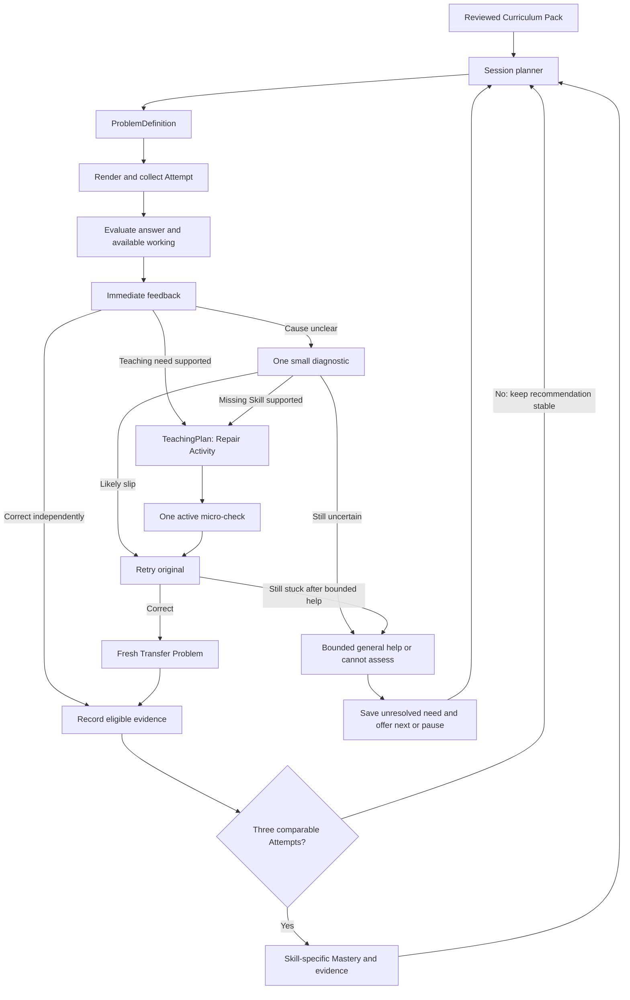

# Adaptive learning: three end-to-end design variants

Date: 2026-09-05  
Status: three-variant design proposal. The prerequisite-aware introduction has been accepted and added to the product specification; other variant choices and numerical policies remain proposals unless explicitly stated there.

## Recommendation

Build Variant 1 with prerequisite-aware introductions for the three-week pilot, with the evidence records and Curriculum Pack fields needed for Variant 2. Make Variant 2 the intended product direction. Consider Variant 3 after the pilot supplies enough representative learning data to calibrate and validate a statistical model.

The central product decision is to adapt to **what a learner can currently do in a particular Skill**, rather than assign a learner a global “weak,” “medium,” or “strong” label. Problem difficulty, amount of teaching support, and Mastery are separate dimensions.

All numerical thresholds, content counts, timing budgets, and schedules below are proposed starting policies, not validated educational constants or implementation already present in this repository.

## Context carried forward

Read against the [product specification](./product-spec.md), [implementation plan](./implementation-plan.md), [domain language](../CONTEXT.md), [LLM learning architecture](./research/llm-learning-architecture.md), [universal architecture](./research/universal-app-architecture.md), [technical stack](./research/mvp-technical-stack.md), desktop design direction, design review, and learning-loop tickets CW-005 and CW-007 through CW-011.

Existing decisions retained in all three variants:

- English Class 6 Mathematics; start at the supplied curriculum's Chapter 1, without a placement test. Fractions below are illustrative, not an assumption about Chapter 1.
- Chapter Play, Mixed Practice, and an approximately ten-minute Daily Quest; all published Skills remain playable.
- Immediate feedback on each Attempt; reconsider difficulty and publish Mastery changes after three comparable Attempts.
- Diagnose uncertainty, teach through Prism, retry the original Problem, and verify with a fresh Transfer Problem.
- Deterministic policy owns Mastery and selection; a model may interpret evidence and recommend teaching moves.
- Reviewed, versioned Curriculum Packs; structured ProblemDefinition, TeachingPlan, and DiagramSpec contracts; no unreviewed live lessons.
- Responsive Expo/React Native Web client, Supabase backend, explicit TypeScript workflow. Later native clients use the same contracts.
- XP and Streak reflect activity, not ability. Boss Problems may accept photographed working, with transcription confirmation when uncertain.

The supplied diagram is the architectural reference. This document proposes the missing behavior inside its Evaluation, TeachingPlan, Mastery updater, and Session planner boxes.

## 1. Shared loop: two kinds of feedback



**Teaching feedback operates immediately.** It answers “What should Prism say or show now?” A learner should not answer two more Problems before receiving help. Repair difficulty can simplify immediately because that changes support for the current obstacle, rather than permanently lowering Mastery.

**Adaptation feedback operates at the evidence checkpoint.** It answers “What should we recommend next, and how should our estimate of this Skill change?” The backend processes each completed group of three comparable Attempts. A correction, retry, diagnostic, and micro-check are not automatically four independent assessment events.

Persist all Attempts as they happen, including pending evidence and unresolved hypotheses. The three-Attempt rule controls the committed Mastery/recommendation update, not data collection or useful teaching.

## 2. What does “student level” mean?

Use three independent dimensions in every variant:

| Dimension | Proposed values | What it controls |
|---|---|---|
| Problem difficulty within one Skill | D1 foundational, D2 standard, D3 stretch | The demand of the next assessment Problem |
| Teaching support for this interaction | Guided, prompted, independent | Visuals, worked steps, and how much the learner must complete |
| Mastery evidence for one Skill | Unknown, developing, secure for current demand; review due as a separate flag | Recommendations and progress descriptions |

“Easy / medium / hard” is acceptable internal shorthand for the three Problem bands. In the learner experience use “Warm-up,” “Practice,” and “Challenge” if labels are needed. These are not three types of learners. Unknown means insufficient evidence, not low ability. Independent success at D1 does not establish security at D3.

Difficulty requires a rubric per Skill. For adding unlike fractions, D1 might use one denominator that divides the other and no mixed numbers; D2 uses unrelated denominators with manageable arithmetic; D3 adds an application or justification. If a harder Problem also requires another Skill, tag that Skill explicitly; do not attribute every error to fraction addition. A Boss Problem is a multi-step format, not automatically a fourth difficulty band.

Changing support need not change the mathematical objective: a learner who understands fraction addition but struggles to read a word Problem may need read-aloud or shorter wording, not an easier mathematics band. Do not infer fixed “learning styles.”

## 3. How we identify a learner who needs help

Track evidence per Skill, per demand band, and per type of support. Use:

- Correctness on the first submitted answer and any assessable working.
- Which step first went wrong, with evidence and uncertainty.
- Whether a hint or answer-revealing help was used before answering.
- Whether a diagnostic supports or contradicts a Misconception Hypothesis.
- Whether the learner succeeds on the original retry, on fresh Transfer, and on later review.
- Repetition across distinct Problems and sessions.

Do not treat response time, abandonment, XP, reading speed, OCR failure, or provider failure as evidence of low mathematical Mastery. Time and repeated help requests can prompt an offer of support; neither should demote Mastery on its own. A correct answer can be a guess; a wrong answer can be an arithmetic slip. Ask for one small discriminating action where that distinction matters.

Example: a learner answers `1/2 + 1/3 = 2/5`. The answer suggests adding denominators, but does not prove that this is their general rule. Ask “Which fraction equals 1/2: 2/6, 3/6, or 4/6?” If they fail, equivalent fractions become a supported teaching target. If they succeed, inspect equal-sized units or the addition step rather than reteaching equivalence automatically.

Use statements such as “Let's make the pieces the same size” and “You used equivalent fractions independently.” Avoid “You are a weak student.”

### Comparable evidence: precise proposed contract

An adaptation window contains three eligible, distinct Problem opportunities for the same primary assessed Skill and difficulty band, under the same compatible rubric and policy version. Separate windows persist across sessions; three unrelated Problems in Mixed Practice do not make one window.

For the pilot, allow a window to span at most seven days. Expire older pending entries from the window without deleting history; schedule fresh evidence instead. This is a tunable recency rule.

| Event | Stored? | Counts toward the three-Attempt window? |
|---|---|---|
| Assessable first answer on a fresh Problem, before teaching help | Yes | Yes, correct or incorrect |
| Fresh Transfer at a matching band, answered without help | Yes | Yes, tagged as immediate post-repair evidence |
| Original retry after repair | Yes | No; records recovery, not independence |
| Repair micro-check or tiny diagnostic | Yes | No; informs teaching and hypotheses |
| First answer after a mathematical hint | Yes | No; records supported performance |
| Uncertain photo transcription, unassessable work, abandonment, system error | Yes, with reason | No |
| Resubmission of the same request or repeated answer to the same Problem | Yes where useful | Never counts again |

Transfer contributes useful evidence but is temporally related to repair. Do not declare durable Mastery from immediate Transfer alone; require later independent review. Repeated hints can leave the window incomplete: give a fresh, lower-support check when appropriate, without counting the supported answers as independent failures.

For a multi-Skill Boss Problem, only create Skill evidence where a verified step actually assesses that Skill. A wrong final answer does not lower every tagged prerequisite. V1 may simply exclude ambiguous multi-Skill work from band updates.

## 4. Variant 1 — A transparent difficulty ladder

**Core idea:** select the next Problem from three bands using a small, auditable rule table. Use approved feedback and repair branches for common errors.

### End-to-end behavior

1. A new learner begins in Chapter 1. For a new Skill, introduce the goal and consult their prerequisite evidence. Skip recently demonstrated prerequisites, check relevant unknown ones before teaching the answer, and teach supported gaps with approved activities. Use a fresh follow-up before continuing to an accessible D1 target Problem. This is part of play, not placement; detailed branching is defined below.
2. Check the Attempt. Return brief success feedback or an error-specific cue immediately.
3. For an unclear error, choose a pre-authored diagnostic from the Problem template. Use structured model assistance for open working or when the known branches do not cover the evidence.
4. Select an approved Repair Activity. Start guided if the diagnostic reveals a missing prerequisite; use a single prompt if the likely issue is a slip.
5. Ask one micro-check; simplify once if needed; retry the original; then issue fresh Transfer.
6. At three eligible Attempts, apply the policy below and record its reason.
7. Choose the next published Problem in the selected band, excluding recently seen instances. Preserve the learner's selected Chapter or Mixed Practice context.

### Proposed policy

| Window outcome | Next action |
|---|---|
| 3 independent successes | Try one band harder, capped at D3; this is provisional readiness, not durable Mastery |
| 2 successes, 1 error | Stay at the band; repair the observed error locally |
| 1 or 0 successes with varied, assessable errors | Move down at most one band; at D1, stay and increase support |
| Three errors support the same hypothesis and a diagnostic supports a prerequisite gap | Recommend that prerequisite, taking precedence over an ordinary band reduction |
| Three slots contain uncertain/unsupported evaluations | Those entries are ineligible; do not manufacture a checkpoint |

If the learner chooses a harder published Problem, allow it. Treat this as a learner choice rather than a change to the automatic recommendation. Keep band evidence separate.

### Explanation generation

At authoring time, draft and review one canonical explanation plus three support presentations for each covered error: a visual worked example with a micro-check; a partial example with a missing step; and a concise cue. Runtime selects and fills approved parameter slots. The LLM does not need to write new prose for an ordinary numeric Attempt.

These are three presentations of one mathematical idea, not three independently maintained textbooks. Keep the definitions, answer evidence, and core mathematical steps in one canonical record.

### Example

On `1/2 + 1/3 = 2/5`, select the denominator-error branch, run the equivalence probe, then show equal-whole fraction bars and ask the learner to identify `1/2 = 3/6`. Return to the original. Transfer might be `1/3 + 1/4`, whose answer is `7/12`; the authoring rubric must mark it comparable to the original before it enters the same window.

### Implementation and trade-off

Store a recommended band and pending evidence windows per Skill, a small hypothesis history, a reviewed prerequisite graph, and mappings from intro/error/diagnostic outcomes to repair assets. The adaptive policy is a pure function over these records. V1 follows explicitly authored prerequisite checks and branches; V2 expands this into runtime selection among competing misconception hypotheses and richer teaching paths.

This is the lowest runtime cost and easiest variant to audit and ship. It handles common gaps well, but a coarse band can hide different reasons for struggling. Content authors must explicitly cover likely repair branches. Suitable for the three-week pilot with a limited, deeply reviewed Skill slice.

### Accepted addition: introductions adapt to each learner

Think of the coursework graph as a shared map and the learner evidence as notes about which roads that learner can already travel. Different learners need different detours through the same map.

**The shared map** records Skill IDs, prerequisite relationships, when each relationship applies, diagnostic assets, teaching assets, and fresh follow-up Problems. **The private learner record** stores observed Attempts, support used, assessment dates, and uncertainty for those Skill IDs. A learner error never silently rewrites the shared map.

At the start of a new Skill:

1. Keep the target Skill visible and persist it as the return destination. There may not yet be an original target Problem or Attempt; the runtime must support returning to an introduction as well as retrying a Problem.
2. Identify prerequisites relevant to the intended Problem and supported method. Separate required foundations from helpful shortcuts. For example, finding the least common multiple is useful for efficient fraction addition, but using a valid common denominator does not always require the least one. Do not force an unnecessary prerequisite just because one worked solution uses it.
3. Consult learner evidence for each relevant prerequisite. Use the following rule table to select a short path, rather than testing every ancestor in the graph.
4. Observe each selected check before showing its solution. A help request can start teaching immediately but is not an independent incorrect answer.
5. After teaching, ask a fresh follow-up. If the learner can proceed, resume the original target. Preserve whether the follow-up was guided, immediate post-teaching, or an independent assessment; only an explicitly eligible assessment enters its own Skill/demand window.

| Learner evidence for a relevant prerequisite | Intro action |
|---|---|
| Recent independent success at the required demand | Skip the prerequisite check; offer help if requested |
| No evidence | Ask a small diagnostic; unknown does not mean weak |
| Old evidence or conflicting recent results | Ask a fresh check; elapsed time alone does not prove forgetting |
| A supported, unresolved gap | Offer the matching repair; allow a short demonstration if the learner believes they know it |
| Success only with help | Use a fresh unassisted check when appropriate; do not assume independence |

Use versioned recency rules in the implementation; the exact freshness interval remains a pilot policy to evaluate. A skip is a temporary teaching decision, not proof of permanent Mastery. Later work can uncover a gap the intro missed.

For three learners starting unlike-fraction addition:

- Learner A has recent independent equivalence and same-denominator addition evidence: brief introduction, then target practice.
- Learner B can add equal-denominator fractions but has unknown equivalence: one equivalence check, teaching if needed, fresh follow-up, then target practice.
- Learner C struggles with equal parts during the check: offer an equal-parts activity and save fraction addition for the return. Their geometry evidence is unaffected.

Limit the intro diagnostic sequence to two checks, then teach one supported gap or offer a bounded next action. If that teaching reveals deeper missing knowledge, let the foundation become the current activity and save the target instead of recursively expanding the intro. The short introduction cannot establish the entire learner profile. All published Skills remain playable; support and recommendations are not content locks.

### Foundations absent from the textbook

The textbook anchors the curriculum but is not the limit of the teaching library. Earlier-grade foundations can be published as supplemental Skills using the same identifiers and content contracts as textbook-backed Skills.

An LLM can propose a missing prerequisite and draft an explanation, example, diagnostic, and follow-up from its learned knowledge even without a source passage. Treat this as an authoring proposal: the absence of a textbook passage neither makes the mathematics invalid nor makes the generated material verified.

During pack authoring:

1. Walk the target Skills' prerequisite paths and find missing diagnostic/teaching coverage, including earlier-grade foundations.
2. Search the existing approved foundation library first. Reuse compatible material rather than generating one lesson per learner.
3. Prefer approved earlier-grade references when adding a foundation. If none is available, explicitly record model-origin drafting instead of supplying an invented page citation.
4. Validate the proposed prerequisite relationship, mathematical claims, solution steps, example constraints, micro-check answers, diagrams, and follow-up alignment. Checking numerical answers alone does not establish a good explanation or a necessary prerequisite.
5. Require mathematics-expert approval under the existing publication policy, then publish the supplemental content and graph relationships in a versioned pack. Pin compatible versions during a session.

Store `originKind` (textbook, supplemental source, or model-origin), actual source references when available, generation provenance, verification results, reviewer approval, and version. These are proposed content metadata fields, not existing implementation.

At runtime, a previously uncovered need creates a content-gap record with the target Skill, candidate prerequisite, and supporting evidence references. The LLM may suggest a candidate for the authoring queue; it cannot publish a new graph edge or lesson to the learner. Offer compatible approved help or another activity, save the unfinished target, and preserve the learner's existing Mastery when the issue is missing content. Do not make the learner wait for authoring review to finish.

This means most personalization selects from reusable reviewed content. New content generation expands the shared library through a separate publication workflow. Runtime parameter variation is allowed only within already approved templates and validated domains.

### Optional Graphify authoring experiment

Graphify is a candidate for extracting a draft coursework graph from documents, not an adopted dependency. Its documentation describes PDF/Markdown graph extraction and labels for extracted, inferred, or ambiguous relationships. [Graphify documentation](https://graphify.com/docs)

Trial it on one source slice and compare its proposed Skills and links with an expert-authored reference. Topic co-occurrence must not be imported as prerequisite necessity. Import only reviewed relationships into the Curriculum Pack. Keep learner evidence in the app's authoritative data store, separate from any shared document graph. The dynamic learner path does not require running Graphify during play.

This extension is reflected in the product specification and delivery plan.

## 5. Variant 2 — A Skill graph that chooses targeted repair

**Core idea:** ask “Which smallest missing Skill blocks this Problem?” before deciding whether to lower its difficulty. The graph drives teaching selection; three bands still describe assessment Problems.

### End-to-end behavior

1. Select a target Skill from learner choice, pending review, and the recommended Path position.
2. Load its prerequisite evidence. Unknown prerequisite evidence does not lock content or trigger a long test; begin play or a short introduction as appropriate.
3. Evaluate the Attempt and rank a small set of Misconception Hypotheses, each linked to observed work and an approved diagnostic.
4. Choose a probe whose different outcomes distinguish the leading hypotheses. Use a second probe only if it changes the teaching choice; cap the sequence at two.
5. Teach the smallest supported gap with a Repair Activity. A single probe can justify temporary help, but it does not commit a low Mastery label.
6. Resume the original Skill, retry, and verify Transfer. Store whether the chosen repair actually helped.
7. After three comparable Attempts, update the affected Skill's Mastery and recommendation. Evidence about one prerequisite does not automatically demote every dependent Skill.
8. When appropriate, recommend a short prerequisite practice segment while keeping the original target visible and all content playable.

### Learner model and levels

Keep three Problem bands plus Skill-specific evidence and hypothesis states: suspected, supported, contradicted, or unresolved. Record which representation and support amount were effective recently, with evidence counts; do not convert one successful visual into a permanent learner preference.

V1 mostly moves up/down a ladder. V2 can keep fraction addition at D2 while repairing equivalent fractions at D1, or keep equivalence unchanged and repair the meaning of equal-sized units. This is a materially different selection policy.

### Explanation generation

Author reviewed teaching blocks by Skill and misconception: prerequisite reminder, visual demonstration, worked step, contrast example, micro-check, and transfer family. Each block declares entry conditions, required prior knowledge, mathematical claims, and allowed next blocks.

Runtime assembles these into a validated TeachingPlan using approved transition rules. Mathematical text and diagrams remain reviewed assets or validated parameterized templates. Do not assume that individually approved fragments can be joined in arbitrary order: validate the permitted combinations and review representative complete paths.

An LLM may rank hypotheses and approved block IDs. Any genuinely new explanation or analogy goes through the authoring/review pipeline before publication; it is not shown immediately just because it cites a textbook passage.

### Same error, more precise response

For `1/2 + 1/3 = 2/5`, consider equivalent-fraction knowledge, understanding why denominators stay fixed when adding equal units, and an isolated slip.

- If equivalence fails, repair equivalent fractions using equal-whole bars.
- If equivalence succeeds but `2/6 + 1/6` fails, teach adding counts of the same unit.
- If both succeed, prompt the learner to revisit the original conversion step, without asserting a broad gap.

The next fresh assessment tests the identified Skill. Keep an immediate guided micro-check separate from a later eligible assessment even when they target the same prerequisite.

### Implementation and trade-off

Extend the Curriculum Pack with prerequisite relationships, misconception-to-probe mappings, probe outcome interpretations, and permitted teaching-block sequences. Store hypothesis evidence and repair outcomes in the learner record. Select with explicit rules; do not require a model call for every branch.

This gives more specific teaching than V1 but requires better content mapping and diagnosis evaluation. An incorrect graph or probe can cause irrelevant teaching. Bound prerequisite detours to one repair target at a time and preserve a return link to the original Problem. Recommended product direction; pilot only a narrow graph if choosing this variant immediately.

## 6. Variant 3 — Probabilistic Mastery and uncertainty-driven selection

**Core idea:** estimate how likely independent success is, including uncertainty, and choose Problems that balance learning, useful evidence, and review.

Knowledge tracing is an established family of learner models. A foundational model represents Skill knowledge with latent state and parameters for initial knowledge, learning, guessing, and slips. That motivates this variant, but does not establish that it will outperform simple rules in this product. [Corbett and Anderson, Knowledge Tracing](https://perso.liris.cnrs.fr/pierre-antoine.champin/2014/m2iade-ia2/_static/893CorbettAnderson1995.pdf)

### End-to-end behavior

1. Start with explicit population priors and broad uncertainty for an unseen Skill. Do not show invented precision to the learner or administer a placement test.
2. Start with an accessible published Problem. Collect the same evidence as V1/V2.
3. Provide immediate feedback, diagnostics, bounded repair, retry, and Transfer using reviewed content.
4. After three comparable Attempts, replay those observations in order through a pinned statistical update. The result is deterministic given evidence and model parameters. Reprocessing an observation does not update it twice.
5. For each available candidate, estimate independent-success probability, uncertainty, review need, and curriculum relevance.
6. Choose a candidate within explicit constraints. As an initial experiment, prefer roughly 70–85% predicted success for ordinary practice, with occasional informative probes and due reviews. This range is a hypothesis to test, not a proven optimum.
7. Track later review results to calibrate predictions and any forgetting model. No automatic assumption that time away proves lost knowledge.

### Levels and model choice

The internal estimate is continuous; the content still has D1/D2/D3 bands and the learner sees the same simple support choices. A probability is an estimate for a defined Skill/demand, not a universal student score.

Start with a knowledge-tracing baseline over atomic Skills. A basic knowledge-tracing model does not automatically learn item difficulty, prerequisite graphs, or forgetting. Add item/band effects or a separate success-prediction layer only when the data supports them. Fit parameters offline, assess calibration on held-out learners, and version the fitted model before deployment. Do not treat LLM self-reported confidence as a calibrated probability of learner knowledge.

Until validated, use V1 policy for Skills/items with inadequate data. Never assign statistical-looking probabilities by simply renaming hand-written band scores.

### Explanation generation

Use V2's reviewed block library. Add an intervention-selection model only after there is enough evidence to compare support choices. Initially select with transparent rules. Later, it can rank approved repairs by estimated independent Transfer and delayed-review outcomes for similar observed contexts.

A sophisticated learner model does not require more unconstrained prose generation. It changes *which* approved interaction is chosen. Observational correlations between a repair and success do not establish that the repair caused the improvement; use controlled comparisons before making efficacy claims.

### Same error, history-sensitive response

For a learner with recent independent fraction successes, one `2/5` answer should not cause a large recommendation change. Use a small probe and brief prompt. For a learner with repeated equivalent-fraction errors and low evidence, prioritize a guided repair. For an unseen learner, gather discriminating evidence before treating either explanation as likely.

### Implementation and trade-off

Add fitted parameter versions, Skill-state snapshots, candidate prediction records, and a scheduled offline fitting/evaluation workflow. The existing backend still owns policy and state transitions. Statistical updates can be cheap at runtime; the major added cost is data collection, calibration, monitoring, and maintenance, not necessarily LLM tokens.

This offers finer adaptation if predictions are calibrated. With sparse or biased data it can be confidently misleading. It is a post-pilot option, not justified by a small demonstration dataset alone. A deep-learning knowledge-tracing model or reinforcement-learning policy is not needed to start.

## 7. Comparison

| Design question | V1: difficulty ladder | V2: Skill graph | V3: probabilistic Mastery |
|---|---|---|---|
| Main decision | Easier, same, harder? | Which Skill needs repair? | Which candidate best balances learning and uncertainty? |
| Evidence of need | Repeated independent errors and a supported probe | Localized evidence for a particular prerequisite or misconception | Low predicted independent success, uncertainty, and diagnostic evidence |
| Problem bands | Three | Three per Skill | Three authoring bands; continuous internal prediction |
| Explanations | Select complete reviewed variants | Assemble approved teaching paths | Rank approved paths using evidence, later calibrated predictions |
| Personalization | Difficulty and support | Skill, misconception, representation, support | Those choices plus uncertainty and review timing |
| Authoring burden | Moderate | Higher: graph and diagnostics | At least V2's burden |
| Runtime model use | Exceptional evaluation; optional checkpoint synthesis | Ambiguous diagnosis and block ranking | Similar to V2; statistical selection need not call an LLM |
| Main failure | Coarse difficulty changes | Misdiagnosed prerequisite | Poorly calibrated predictions |
| Three-week fit | Best | Feasible only with narrow content coverage | Poor |

## 8. How lessons and explanations are created

The app should offer both a **short introduction when a Skill is new** and a **targeted Repair Activity when an obstacle appears**. It should not require a learner to fail before any teaching is available. Successful learners can skip the longer introduction and receive concise reinforcement or a challenge.

### Offline authoring and publication

1. Ingest the supplied textbook/curriculum and preserve page/section provenance.
2. Draft atomic Skills, prerequisite relationships, canonical mathematical explanations, valid methods, likely errors, diagnostics, Problem templates, and teaching activities.
3. For each Problem template, specify band criteria, parameter domains, mathematical constraints, expected answer, reference working, primary assessed Skill, other required Skills, and transfer compatibility.
4. Generate structured support presentations of each explanation: guided visual, partial worked example, concise prompt. Every presentation has one learner action and a return route.
5. Validate references, prerequisite cycles, mathematical claims, answers, micro-checks, transfer freshness, diagram semantics, accessible text, and allowed TeachingPlan transitions.
6. Have a mathematics expert approve canonical explanations, templates and their parameter ranges, diagnostic interpretations, and representative complete repair paths. Queue disagreements and exceptions for review.
7. Publish an immutable Curriculum Pack. Record source, review, schema, and content versions.

For the first pilot, pre-generate and validate the finite served Problem pool before publication. Later, instantiate approved templates at runtime only within their reviewed domains, validate each instance before serving, and fall back to a prevalidated instance on failure. Open-ended model generation of a new Problem or explanation remains a draft requiring publication review.

### Runtime TeachingPlan construction

Retrieve the active Skill, relevant prerequisites, approved sources, accepted solution evidence, observed error, and matching teaching assets. Choose a reviewed plan or permitted block sequence. Bind validated values and semantic diagram parameters. Return structured data for the client to render with the shared design system.

An illustrative plan for equivalent fractions contains:

```json
{
  "schemaVersion": "1",
  "packVersion": "class6-en-pilot-1",
  "targetSkillId": "equivalent-fractions",
  "returnProblemId": "original-problem-id",
  "supportMode": "guided",
  "reasonCode": "diagnostic_supports_equivalence_gap",
  "sourceIds": ["approved-source-id"],
  "blocks": [
    { "assetId": "equal-whole-bars-half-sixths" },
    { "assetId": "complete-half-as-sixths" }
  ],
  "nextAction": "retry_original"
}
```

IDs here are illustrative schema examples, not existing published assets. The asset defining the micro-check also holds its answer evidence and validator on the server. Problem delivery must not expose private solutions in the assessment payload.

Retrieval supplies grounding; it does not certify correctness. A model's ability to solve a Problem does not establish reliable first-error diagnosis. Research on verified tutoring feedback supports evaluating the learner's work separately before generating the teaching response. [Daheim et al., Stepwise Verification and Remediation](https://aclanthology.org/2024.emnlp-main.478/)

### Initial content coverage proposal

For each pilot Skill, begin with three bands and at least six distinct validated assessment instances per band, drawn from at least two template families where the Skill allows. This is an initial capacity estimate, not sufficient coverage for indefinite practice. Reserve fresh instances for Transfer and later review, and expand the pool based on session consumption and repeat rates.

Cover two or three common misconception branches per Skill, each with a discriminating probe, a guided repair, a lighter support option, and a safe general fallback. Prefer fewer well-covered published Skills to many Path destinations without usable repair content. Unpublished destinations can be shown as planned; every *published* Skill remains playable.

## 9. Session planning and preventing endless remediation

The current plan specifies six Problems per Daily Quest. Proposed interpretation: six assessed Problem slots, with a Transfer Problem consuming an unserved slot. Diagnostics, repair micro-checks, and original retries are attached to their original slot and do not inflate the displayed counter.

- Build a provisional route, then fill unserved slots using the current recommendation and content availability.
- Start with a familiar review or accessible Problem; concentrate enough practice on one Skill to permit meaningful evidence collection. Mixed Practice may carry incomplete Skill windows into another session.
- Reserve the final slot for Transfer if a late repair requires it. If the sixth Problem itself needs repair, offer a clearly identified extra Transfer check or let the learner finish and schedule it next time. Mark transfer as pending, never passed, if deferred.
- After one diagnostic sequence, one repair with at most one simplification, and the original retry, avoid reopening the same chain indefinitely. On continued difficulty, save the unresolved target, offer an approved worked example or simpler guided activity, and let the learner continue or pause. A revealed answer makes subsequent same-Problem success assisted.
- A failed Transfer gets feedback and bounded support, then a pending practice recommendation. Do not recursively generate more and more Transfer checks.
- Treat ten minutes as an estimate, not a deadline that rushes the learner. Allow pause/resume, and offer an early stopping point when repair extends the session.

Proposed review schedule: check the repaired Skill in the next session, then after roughly three and seven days if independently successful. If a review is missed, retain prior evidence and mark review due. These timings require pilot evaluation; V3 could eventually personalize them.

This slot accounting and pending-Transfer behavior clarify an unresolved interaction between the six-Problem plan and mandatory repair/Transfer. They require an explicit product-spec/ticket update if selected.

## 10. Implementation responsibilities

Keep the client interface small. A learning-runtime module owns the workflow; the client renders the returned state rather than reconstructing learning policy.

| Module | Responsibility |
|---|---|
| Curriculum publication | Produce and serve only compatible, reviewed pack versions |
| Evaluation | Verify correctness, preserve observed working, propose evidenced hypotheses, and abstain when necessary |
| Teaching | Select approved support, produce TeachingPlan, and enforce bounded repair |
| Mastery and selection | Consume eligible evidence once, update per-Skill state at checkpoints, and select published candidates |
| Learning runtime | Authorize, persist ordered transitions, coordinate the modules, and return the current learning scene |

Illustrative external interface:

```ts
startQuest({ learnerId, mode, chapterId?, requestId }): Promise<LearningScene>
submitAttempt({ sessionId, problemId, response, requestId, expectedRevision }): Promise<LearningScene>
advanceLearning({ sessionId, action, requestId, expectedRevision }): Promise<LearningScene>
resumeQuest({ sessionId }): Promise<LearningScene>
```

The server derives authenticated ownership, canonical answer evidence, support already delivered, pack version, and eligible next actions. It never trusts client-submitted correctness, hint-use claims, Mastery, or rewards. `advanceLearning` accepts only actions permitted by the current state, including requesting help; a repair answer is still an Attempt.

Persist:

- Session state/revision and original → repair → retry → Transfer relationships.
- Raw structured Attempt and support exposure; immutable Evaluation with evidence references.
- Hypotheses and diagnostics; teaching asset IDs and outcomes.
- Evidence eligibility and exclusion reason; window membership and consumed event IDs.
- Mastery snapshots, pending windows, review dates, chosen candidate and reason code.
- Pack/policy/validator/model/prompt versions and references needed to audit a decision.

Use an idempotency key and optimistic session revision so a double tap or two devices cannot award evidence twice. Commit the accepted transition, evidence consumption, Mastery update, and reward events atomically. Do not hold a database transaction open during a model call: record pending Evaluation, perform the call, then finalize only if its request and session revision remain valid. Replaying model-assisted history uses the stored Evaluation rather than asking the model again.

For numeric/choice cases, return verified feedback immediately. For unresolved open working, show an honest checking state, then validated feedback or a recoverable `cannot_assess` result. Timeouts and invalid plans use approved fallback content; uncertain photo transcription asks for correction and does not affect Mastery. The fallback must not claim to have found an error it could not assess.

## 11. How we test whether adaptation helps

Before the pilot, verify the mathematical and workflow invariants with authored cases: correct alternative methods, slips versus misconceptions, supported versus independent success, guessed choices, ambiguous photos, duplicate submits, stale sessions, missing content, failed repair, and failed Transfer. Test through the learning-runtime interface, plus focused tests of deterministic validators and the three-Attempt policy.

Evaluate generated Evaluation quality separately from deterministic math checks. An LLM confidence threshold needs a labeled calibration set; self-reported confidence alone is not a launch gate. Require verifiable evidence or choose a probe/abstention. Mathematics experts review first-error and diagnostic appropriateness on representative cases before launch.

Measure:

- Independent success on fresh Transfer after repair, with hint use and non-completion reported separately.
- Independent success on delayed review; immediate Transfer alone does not demonstrate retention.
- Incorrect/confident diagnoses and unnecessary prerequisite detours.
- Repair completion, time spent, repeated help, and exits as usability signals, not ability scores.
- Recommendation oscillation, repeated-item exposure, content fallback frequency, and cost/latency per completed loop.
- For V3, prediction calibration on held-out learners, by Skill and interaction format.

When comparing variants, hold curriculum coverage and assessment difficulty sufficiently constant. Raw in-session accuracy is misleading if one policy simply gives easier Problems. Use a common independent follow-up assessment and report uncertainty; a small pilot is primarily a usability and failure-discovery exercise, not proof of learning efficacy.

## 12. Proposed choice and delivery sequence

**Pilot: V1 with prerequisite-aware introductions, plus the content/evidence foundation for V2.** Implement the generic records and one deeply covered prerequisite repair path, including reviewed supplemental foundations. Keep selection as the explicit V1 rule table; do not quietly introduce three competing runtime planners.

**Next: V2.** Expand reviewed diagnostic coverage and graph-guided repair when pilot evidence shows where the ladder's explanations are too broad. Preserve the same client contracts and event history.

**Later: V3 if justified.** Fit and evaluate a baseline model in shadow mode, comparing its recommendations with actual outcomes without changing learner experiences. Activate only after it is calibrated and demonstrates value over transparent rules.

The prerequisite-aware introduction and reviewed supplemental-foundation policy are recorded in the canonical specification and plan. Remaining choices to confirm when selecting a full variant: three within-Skill difficulty bands; three adjustable support modes; exact evidence eligibility and recency rules; six-slot/Transfer accounting; and detailed review scheduling. This addition does not approve all proposed thresholds or adopt Graphify.
