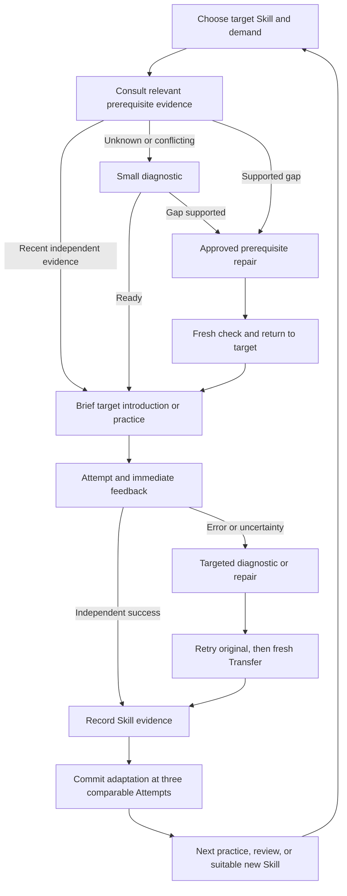

# Quadratic learning loop and ingestion engine

Date: 2026-09-05

Implementation update (2026-09-06): the user subsequently simplified this proposal to one manually prepared JSON pack and one rule-based loop, deferred the ingestion script, and requested custom email/password accounts. The working prototype is in `../quadratic-workshop/`; its README describes the implemented scope and remaining limits. The broader ingestion architecture below is retained as a future proposal.
Status: research-informed design proposal. Current user scope is Class 10 Quadratic Equations, continuous adaptive learning, and content ingestion. 3D, Blender, and immersive-game work are deferred. This note proposes implementation choices; it does not mean that the engine has been built.

## Recommendation

Integrate the supplied Graphify extraction as draft curriculum structure. Present a small number of meaningful learning milestones, track evidence on assessable Skills underneath them, and select Problems by Skill, demand, assistance, and review need. Use three authoring difficulty bands where the Skill warrants them. Do not create one game level per raw graph node or force every learner through every easy/medium/hard set.

The first deliverable should be a reviewed Curriculum Pack produced by a repeatable ingestion pipeline and consumed by one complete learning loop. A graph viewer, vector index, or bank of questions alone does not satisfy that deliverable.

## 1. The graph and the learner-facing Path have different jobs

The supplied `curriculum-extraction.json` contains 38 nodes:

| Raw node kind | Count | Treatment |
|---|---:|---|
| Course | 1 | Chapter/course container |
| Teaching module | 8 | Candidate grouping for a visible milestone |
| Skill | 12 | Starting point for assessable learning outcomes; split or merge after review |
| Prerequisite | 9 | Shared foundation Skills and targeted support; many are too broad as currently written |
| Application | 5 | Problem contexts/families, not automatically separate Mastery estimates |
| Assessment | 3 | Source exercise collections to map to Skills and validators |

The 60 relationships have different meanings. `contains` and `develops_skill` express grouping, `assessed_by` links source exercises, `precedes` is a teaching-order suggestion, and `prerequisite_for` represents a proposed readiness relationship. These must not all become progression gates.

The exported `graph.json` declares `directed: false`; its source/target tuples match the extraction, and the viewer draws arrows. Import typed, directed relationships from the extraction and explicitly validate them. The current 21-edge prerequisite subset has no cycles, but that does not establish pedagogical correctness.

A competency model can distinguish outcomes, relationships, and rubrics. CASE offers an interoperability example of this separation; it does not prescribe game levels or prove an adaptive algorithm works. Borrow the structure without implementing a full CASE server in the MVP. [1EdTech CASE overview](https://www.1edtech.org/standards/case/about)

### Proposed six visible milestones

1. Recognise and organise quadratic equations.
2. Understand and verify roots.
3. Solve by factorisation.
4. Solve using the quadratic formula.
5. Determine the nature of roots.
6. Model and solve situations, then check their meaning.

These are clear destinations in the learner's Path, not six atomic Skills. For example, factorisation may require finding a suitable split, factoring by grouping, applying the zero-product property, and solving linear factors. The engine needs to distinguish those obstacles. A learner already given the factors does not need middle-term splitting as a prerequisite to finding the roots.

Use a Skill boundary when it corresponds to an observable action with a distinguishable error and useful teaching response. Split “Real Numbers and Arithmetic” into needed foundations such as signed multiplication and square-root operations. Do not create tiny independent states for every keystroke. Review granularity against actual learner errors.

All published milestones remain playable. Recommendations highlight a useful route; prerequisites guide checks and support. A learner who already knows foundations can proceed, and an unknown state is not treated as failure. Requirements are conditional on the task and permitted method: Pythagoras is relevant to a right-triangle application, not every quadratic equation.

Milestone completion and Skill Mastery remain distinct. A milestone's published rubric defines the required Skills and demand for completion; optional stretch work need not block it. Later review can be due without erasing the learner's completed journey.

## 2. Three difficulty bands are useful authoring labels

Use **foundational / standard / stretch** internally, with simple learner-facing wording if needed. These label Problems, not people. Not every small prerequisite requires three artificially different tiers, and three is an engineering starting choice, not a research-established optimum.

Illustrative factorisation Problems, all with no assistance initially:

| Band | Problem | Demand being varied |
|---|---|---|
| Foundational | `x² − 5x + 6 = 0` | Monic quadratic; integer roots 2 and 3 |
| Standard | `2x² + x − 6 = 0` | Non-unit leading coefficient; roots −2 and 3/2 |
| Stretch | `6x² − x − 2 = 0` | More demanding signed factorisation; roots 2/3 and −1/2 |

These are illustrative assignments requiring teacher review and pilot calibration. Demand also depends on familiarity, representation, arithmetic, and response format. Larger numbers alone do not establish meaningful difficulty. If a harder Problem introduces expansion, a word model, or a new representation, tag those additional Skills explicitly so errors can be attributed correctly.

Keep three dimensions independent:

- **Skill:** what the learner is practising.
- **Problem demand:** what the unaided task requires.
- **Support:** a worked example, a partly completed step, a prompt, or independent work.

We may keep a standard Problem and provide one targeted sign reminder rather than demote the learner to foundational mathematics. Mathematical help changes the evidence status of that Attempt. Read-aloud or an accessible input method is not automatically mathematical assistance and should not reduce credit.

Within a session, gradually remove teaching support and collect fresh independent evidence. Content bands can later be refined using real performance data, with confidence and sample-size reporting. Do not begin with invented numerical difficulty estimates or LLM-generated ability percentages.

## 3. The continuous learning loop



Record evidence on every Attempt. The existing three-comparable-Attempt rule governs committed difficulty/Mastery updates; feedback and prerequisite teaching do not wait. Fewer than three eligible observations keep the automatic demand recommendation stable while teaching can still change.

Comparable assessment windows are per primary assessed Skill and compatible demand/rubric. Persist incomplete windows across sessions; unrelated mixed-practice Problems do not fill one window. A retry, diagnostic, and guided micro-check are not three independent successes. A fresh unassisted Transfer contributes tagged post-repair evidence, and delayed independent review is needed to test retention. Exact recency and completion rules remain policy parameters to validate.

The policy considers four next actions: practise the current Skill, repair a supported prerequisite, revisit a due Skill, or recommend an appropriate new Skill. Prefer the original target's return/Transfer obligations during an active repair episode. Across sessions, balance review with progress; do not trap the learner in permanent foundation work or mix unrelated Skills before they have a foothold in the current method.

An introductory check sequence is capped at two probes before teaching or offering a bounded next activity. A repair has one simplification before the app offers a useful continuation or pause. An unresolved deeper foundation can become the current activity, with the original target saved. Missing content, unreadable photos, and system failures do not lower mathematical Mastery.

### Example: the same quadratic, three learners

The target is `x² − 5x + 6 = 0`.

- Learner A recently demonstrated factorisation and linear equations: skip prerequisite probes and collect independent solving evidence.
- Learner B produces `(x − 2)(x − 3)` but cannot find roots: inspect the zero-product or linear-factor step and teach the supported gap. Do not make them repeat factorisation.
- Learner C cannot find the required pair: offer a sum/product check, then repair signed-number reasoning or factor selection according to the evidence. Return to the target once ready.

A multiple-choice answer alone may not reveal which step failed. Use discriminating steps when needed, then return to a less guided task so the app does not permanently turn solving into following instructions.

### What research supports

The IES practice guide recommends spacing, alternating worked examples with independent problem solving, and connecting graphical/concrete and abstract representations. It distinguishes the strength of evidence across recommendations: brief introductory pre-questions have weaker support than re-exposure through retrieval. Our exact two-probe intro, three-Attempt checkpoint, six milestones, and three difficulty bands are product policies, not conclusions established by that guide. [IES practice guide](https://ies.ed.gov/ncee/wwc/PracticeGuide/1)

Additional primary studies and limitations are captured in [adaptive-practice evidence](./research/quadratic-adaptive-practice-evidence.md).

## 4. Build ingestion as a curriculum compiler

The engine converts source material and draft graph structure into validated, reviewable learning assets that the live loop can actually use. Its output is an immutable Curriculum Pack, plus an explicit report of remaining gaps.

```text
Textbook PDFs + answer references + Graphify extraction
  → preserve and extract source content
  → normalise Skills and typed relationships
  → identify coverage and prerequisite gaps
  → draft teaching, assessment, and repair assets
  → validate mathematics and teaching paths
  → review and approve
  → publish versioned Curriculum Pack
  → learning runtime

Runtime content/diagnosis failures → review queue → revised pack
```

### Stage A: preserve and extract

Store source identifiers and hashes, file origin, printed/PDF page mapping, sections, examples, exercises/subparts, and links to answers. Keep original math alongside normalised notation. Extract structured mathematical objects rather than treating flattened PDF text as trustworthy LaTeX. Flag ambiguous radicals, minus signs, fractions, and layout-derived equations for visual review.

Extraction is idempotent by source hash and extractor version. Run slow OCR/LLM work as resumable authoring jobs, not inside a learner's submit request. Material in a PDF or graph is source data; embedded instructions cannot change the engine's policy or publication rules.

### Stage B: normalise curriculum structure

Import the Graphify extraction, retaining raw IDs and provenance. Map course/modules/Skills/applications/exercises into distinct records. Preserve stable Skill identities when sources are revised; maintain an explicit old-to-new mapping when splitting or merging Skills instead of silently discarding or copying learner Mastery.

Represent prerequisite direction, justification, applicable task/method, and review status. Validate references and cycles only within the appropriate relationship types. AI may suggest missing links or splits, but does not publish them automatically. A documented relation confidence is not reviewer approval.

### Stage C: measure coverage before generation

For each assessed Skill and supported demand, produce a coverage matrix:

`introduction | diagnostic | practice | repair | Transfer | review | validator | source/review status`

Separate “Skill exists in graph” from “Skill is publishable.” A Skill with no usable diagnostic or repair does not yet fulfil the adaptive promise. Reuse reviewed foundations from other chapters or supplemental content. Queue model-origin drafts with honest provenance when the needed material is absent from the supplied book.

### Stage D: author reusable learning assets

Generate structured templates and support blocks, not unrestricted text per learner. Each asset has:

- Primary assessed Skill; other required Skills; demand rubric; supported method and response format.
- Parameter domains, constraints, expected answers, accepted equivalent forms, and solution evidence.
- Diagnostic purpose and outcome interpretation, linked to specific Misconception Hypotheses.
- Approved short explanation, worked example, partial-step activity, concise hint, and any semantic DiagramSpec.
- Transfer/review family, non-repetition rules, source references or model-origin metadata, and approval status.

Generate factorisable quadratics from constrained factor/root templates where appropriate, then solve independently to check the result. For formula/discriminant tasks, explicitly cover positive nonsquare, zero, and negative discriminants. Do not accidentally publish a “factorise using rational factors” task whose quadratic is irreducible over the rationals. Context tasks also need domain/units constraints.

A canonical explanation can have several support presentations, but all share verified mathematical claims. A learner's route selects approved blocks; a unique learner profile does not imply a newly generated lesson.

### Stage E: validation and review

Use layered checks:

1. Schema, references, source links, versions, graph relations, and permitted teaching transitions.
2. Quadratic validity after simplification, including the `a ≠ 0` condition and cancellation of apparent quadratic terms.
3. Exact root/equivalence checks, real-root classification, repeated-root handling, fractions/surds, and declared approximation tolerance.
4. Step/rubric checks that permit supported valid methods and detect solution-changing transformations, omitted roots, or invalid contextual solutions.
5. Diagnostic discrimination, answer leakage, diagram/text agreement, accessible alternatives, and genuinely fresh Transfer.
6. Expert review of Skill boundaries, prerequisite necessity, canonical explanations, assessment items, and exceptions before publication under the existing content policy.

An independent model can flag disagreement; agreement between models is not a proof of mathematical or pedagogical correctness. Route ambiguity and unsupported validation cases to review. Keep draft material playable only in an internal review environment, never mark it learner-published just to make a demonstration work.

### Stage F: publish and serve

Initially publish a finite prevalidated Problem pool produced from the reviewed templates. Later parameterise approved templates at runtime within verified domains and validate each instance before serving. Pin pack versions during sessions, keep answer keys server-side, and record which content/policy versions produced each Evaluation.

Publishing must be repeatable and atomic; failed ingestion cannot replace the current good pack. Keep prior packs for reproducibility/rollback, with explicit compatibility rules for learner evidence. A content-gap report from a session becomes an authoring job; it never lets the LLM silently modify the live graph or introduce an unreviewed lesson.

## 5. What the smallest useful implementation includes

Use ordinary source-controlled pack files and relational tables for Skills, relations, assets, Attempts, and learner evidence. The graph has tens of nodes; a dedicated graph database, Graphify runtime server, or graph-neural model is unnecessary for the pilot. Graphify is an import/authoring aid.

Two substantial modules are enough to organise the initial work:

- **Curriculum publication:** ingest, validate, produce coverage/review reports, publish/load packs.
- **Learning runtime:** start/resume, submit Attempt, request help, advance to the next permitted scene; internally own Evaluation, teaching selection, evidence windows, and next-Problem policy.

Store learner identity and evidence separately from shared curriculum data. Use authenticated ownership, idempotent Attempt submission, session revisions, and exactly-once evidence consumption. Persist model-assisted Evaluation results for replay instead of expecting a new model call to reproduce the same response.

### Proposed first acceptance slice

Ingest the factorisation section and necessary foundations; produce reviewed content for selecting factors, the zero-product property, and solving linear factors. Then demonstrate three different learner paths through the same target Problem: ready learner, unknown prerequisite, and supported gap.

The slice is complete when it:

- Produces a source-linked coverage report and a publishable pack without handcoding lesson content into screens.
- Gives immediate correct or useful uncertain/error feedback.
- Selects different repairs from different evidence, preserving the original target.
- Distinguishes assisted recovery, fresh independent Transfer, and later review.
- Updates the correct Skill window once, survives refresh/replay, and explains the next recommendation.
- Queues missing content and continues with approved alternatives instead of inventing live teaching.

Then expand through the remaining quadratic Skills using the same pipeline and runtime contracts. Evaluation should measure fresh independent assessment and delayed review alongside completion and enjoyment; accuracy on easier assigned Problems alone is not evidence that the policy improved learning.
