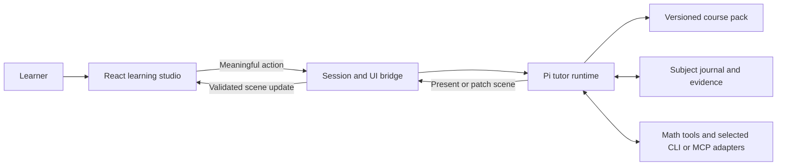

# Pi-led personal tutor: architecture and platform recommendation

Research and proposal, 13 September 2026. This is a decision aid for the requested pivot, not an implementation or a change to the canonical product specification. The two supplied brainstorms were treated as proposals; their browser-first direction was reconsidered against the current Windows-first request.

## Recommendation

Build a **React learning studio with a Pi tutor runtime**, initially delivered as an **Electron Windows application**, followed by macOS. Keep the React renderer and tutor protocol independent of Electron so the same experience can be hosted in a browser. Use Pi's SDK in a separate Node process, a versioned curriculum pack, durable subject-specific learner memory, and a catalog of interactive learning components.

This is an engineering recommendation for this project's combination of a TypeScript harness, existing React assets, local tools, and Windows-first delivery. It is not a claim that desktop is intrinsically better for learning. If student testing shows that installation is the main barrier and local tools add little value, host the same runtime and frontend instead.

**An installer that starts Pi in the background and opens a browser tab is also possible.** It still needs a native launcher and process lifecycle management. It saves the embedded browser but does not remove the desktop distribution work. I would use it as a demo or optional deployment mode rather than the principal Windows experience.

Pi should choose instructional moves, explanations, representations, generated problems, and learning-path revisions. The application should provide reliable storage, tool execution, UI rendering, and recovery. Mathematical computation tools should inform Pi's teaching; there is no need to retain a second fixed-band planner deciding every next step.

## What is already here

The handoff's statement that no app exists is stale relative to this workspace:

- [Existing prototype](../../quadratic-workshop/README.md): React interface, server-backed progress, deterministic tutoring loop, and interactive visuals.
- [Chapter pack](../../quadratic-workshop/content/quadratics.json): 13 Skills and 154 Problems, source references, worked lessons, graph mappings, and numerical visual specifications; version `2026-09-06.2`. Independent educator review remains pending.
- [Learning visual renderer](../../quadratic-workshop/components/learning/learning-visual.jsx), [math rendering](../../quadratic-workshop/components/learning/math-text.jsx), and [visual math](../../quadratic-workshop/lib/visual-math.js): useful building blocks for the new component catalog.
- [Existing engine](../../quadratic-workshop/lib/engine.js): a baseline for comparison and fallback authored practice, rather than the intended new pedagogical authority.
- [Graph](../../quadratic-equations-graphify/graph.json): 38 nodes and 60 links. Its report describes 20 inferred edges and 13 weakly connected nodes. Its top-level `directed` flag is false even though relations such as `prerequisite_for` have directional semantics.

Preserve the existing implementation while creating a separate Pi-driven experience. Its Worker/D1 API is not itself the proposed Node harness host. Reuse components and content behind a new transport interface; do not assume the existing server framework and database configuration will run unchanged inside Electron.

## Is this pattern commonly used?

There are three different patterns to distinguish:

| Pattern | Evidence | Implication |
|---|---|---|
| Persistent agent environment, tools, notes, and selective context retrieval | Anthropic describes hybrid upfront context plus agent-directed retrieval and long-running context management. Pi exposes sessions and extensibility. | This is an established agent architecture to adapt. |
| Curriculum structure plus evidence about a learner's knowledge | ALEKS describes knowledge-space-based adaptation; CMU describes knowledge components and knowledge tracing. | Adaptive learning predates LLM harnesses. A graph can support it, but extracting textbook relationships does not validate a learner model. |
| Pi directing a rich, subject-specific teaching interface | Pi offers embedding primitives; A2UI offers declarative agent UI concepts. | Technically supported by building blocks, but the reviewed sources do not establish widespread production adoption or educational efficacy of this exact combination. |

Sources: [Anthropic context engineering](https://www.anthropic.com/engineering/effective-context-engineering-for-ai-agents), [ALEKS research](https://www.aleks.com/about_aleks/research_behind), [CMU learning-data concepts](https://www.cmu.edu/datalab/getting-started/key-concepts.html), [Pi SDK](https://github.com/earendil-works/pi/blob/main/packages/coding-agent/docs/sdk.md), [A2UI client setup](https://a2ui.org/guides/client-setup/).

The transferable idea is to give the tutor a navigable academic environment. A textbook need not become thousands of special prompt rules, and it need not all be embedded into a vector database. Neither a harness nor retrieval alone supplies pedagogical quality.

## Feed coursework through versioned curriculum packs

Use the existing pack as the starting point, expanded into the following logical structure. This is a proposed format, not a Pi standard:

```text
curricula/cbse/class-10/mathematics/<version>/
  manifest.json                 # class, subject, edition, coverage, stable IDs
  subject-map.json              # chapter relationships and available coverage
  quadratics/
    overview.md                 # objectives, boundaries, chapter orientation
    source.md                   # faithful text with page and equation anchors
    assets/                     # original diagrams/page crops when needed
    skills.json                 # assessable Skills and reviewed prerequisites
    examples.json               # solutions, alternate methods, source anchors
    teaching-notes.md           # misconceptions, useful probes, representations
    problem-seeds.json          # existing items and generation constraints
    visual-recipes.json         # examples using the component catalog
```

Use a manifest field for board/framework as well as class: Class 10 alone does not identify a syllabus. Also identify language and textbook edition. Subject cards should come from available packs; an uncovered subject should not silently become an ungrounded tutor.

The ingestion workflow should:

1. Preserve the source PDF and page anchors; extract text, mathematical notation, and diagrams. Verify equation signs, superscripts, roots, and fractions against the original, rather than trusting plain OCR.
2. Keep raw Graphify output for provenance. Build a teaching projection using relation types and source/target semantics. `contains`, `precedes`, and `assessed_by` are not interchangeable with prerequisites.
3. Separate chapter modules, assessable Skills, application families, and exercise collections. Validate prerequisite cycles and unresolved references. Keep extraction confidence distinct from educator validation and student mastery.
4. Add worked examples, alternative methods, misconception probes, and visual teaching notes. A graph says little about how to explain a negative sign or why a geometric root is impossible.
5. Include labelled prerequisites from earlier classes. These can be visited briefly without switching the student's enrolled class. Broader course coverage will require additional source ingestion and review.
6. Publish a version, stable IDs, coverage statement, and checks. Keep a session pinned to its curriculum version; explicitly migrate mappings when content changes.

This workflow extends the source references, `graphIds`, lessons, and question assets already present locally. Do not fine-tune a model merely to ingest this chapter: runtime access is easier to update, inspect, and attribute. Fine-tuning would be a later response to measured behavioral failures, not the initial storage strategy.

### What enters the model context

At subject-session start, load a **subject briefing** containing curriculum identity, subject map, relevant learner summary, current goal, due reviews, recent evidence, and any unfinished activity. Include the available tool and component descriptions for that subject.

For the current Quadratics chapter, start by loading the chapter overview, compact teaching graph, source text, and selected teaching notes together. The local graph report puts the source corpus at approximately 3,850 words, so full current-chapter context is a reasonable experiment. Measure actual tokens and latency; there is no universal size threshold. Do not automatically include all 154 complete questions or every subject's textbook.

Give Pi tools to fetch a source section, a worked example, prerequisite neighbors, or older attempts when useful. Start with stable-ID lookup and full-text search. Add semantic retrieval when broader coverage or paraphrased queries demonstrate a need. Retrieval should filter by class, subject, edition, and coverage before ranking.

This is our application of the hybrid context pattern, rather than a claim that Pi automatically understands a course folder. Startup context and post-compaction restoration need explicit host/extension integration. [Context engineering](https://www.anthropic.com/engineering/effective-context-engineering-for-ai-agents), [Pi compaction](https://github.com/earendil-works/pi/blob/main/packages/coding-agent/docs/compaction.md).

## Learner memory and session lifecycle

Use **one persistent subject workspace per learner**, with separate Pi conversations for individual study sessions. Resume the same conversation for an interrupted lesson; start a fresh one for a new session with durable subject context. Do not maintain one endless cross-subject conversation.

Separate three kinds of state:

| State | Contents | Ownership |
|---|---|---|
| Observed evidence | Problem, submitted steps, assistance delivered, timestamps, source version, tool results | Host records the actual events durably. |
| Tutor interpretation | Strengths, misconception hypotheses, confidence, explanations that helped, proposed reviews and next goals | Pi writes and revises this, with evidence IDs. |
| Current activity | Goal Skill, active prerequisite detour, current problem, surface revision, unfinished work | Host persists Pi's chosen activity and the learner's UI state. |

Store structured records where IDs, dates, and joins matter, with a readable journal for nuance. This is not a giant state blob pasted into every prompt or a second hardcoded learning engine. A concise, dated subject briefing can be generated from these records, and Pi can retrieve supporting details.

Record observations after meaningful episodes, not only on a clean exit. Persist the submitted attempt before asking the model to respond. If the runtime crashes before Pi writes a journal update, the evidence remains available for recovery. Compaction summaries and raw session logs are useful but are not sufficient learner memory by themselves. Pi's append-only session entries and reconstructed model context are distinct mechanisms. [Pi session format](https://github.com/earendil-works/pi/blob/main/packages/coding-agent/docs/session-format.md).

On setup, the learner selects class, curriculum and language, then sees subject cards. At each new session they choose a subject and see a resume recommendation, recent work, and an option to choose another chapter. Pi uses recent evidence or a short initial probe to select its starting level. It should distinguish unknown from struggling, and should not equate class with ability.

A learner may be strong at factorisation but uncertain about interpreting word problems. Personalize by Skill and evidence, keeping hypotheses revisable. Store broad UI/accessibility preferences separately from academic judgments; successful use of a diagram does not prove a fixed “visual learning style.”

## A learning studio, with Pi directing the activity

Keep navigation, subject selection, help controls, and the basic workspace stable. Pi controls the central teaching surface, using a catalog such as:

- `EquationWorkbench`, `FactorPairPicker`, `ParabolaExplorer`, `AreaModel`;
- `WorkedExample`, `StepComparison`, `HintStrip`, `ReflectionPrompt`;
- `SkillTrail`, `ReviewCard`, and a text explanation with source references.

The model chooses a representation, examples, parameters, highlights, and a layout from supported compositions. Product code supplies typography, interaction behavior, accessibility, and mathematical rendering. This permits varied lessons without asking an LLM to invent executable React for every response.



Proposed bridge tools include `present_activity`, `patch_activity`, `read_course`, `read_evidence`, `record_observation`, and `set_learning_plan`. These names are application contracts, not Pi built-ins.

For example, `present_activity` could refer to one persisted problem and compose an equation workbench with a factor-pair manipulative. The renderer receives the problem statement and visible feedback; private solution and tutor notes remain in runtime storage. A submitted step includes `sessionId`, `activityId`, `surfaceRevision`, `actionId`, and the mathematical input. The authenticated host resolves learner identity rather than trusting a student ID supplied by the model or UI.

Persist a valid scene before emitting it, acknowledge actions, reject stale revisions, and make retries idempotent. A disconnect should restore the same scene and work, not generate a new problem. These are mechanical constraints; they do not decide whether Pi should teach factorisation or the quadratic formula.

Keep dragging, drawing, plotting, math input previews, and animation local and immediate. Send meaningful events such as “check this step,” “hint,” “compare methods,” or “finished exploration.” A turn should end after presenting an activity; the next learner action starts the next turn. Do not hold a model tool open while waiting several minutes for an answer.

A2UI is relevant for catalog-backed UI and AG-UI for frontend event transport, but adopting both is unnecessary to prove the lesson loop. Begin with a small versioned scene/action protocol and a transport adapter. Assess protocol adoption after a real math component can render, emit actions, and recover state. [A2UI client setup](https://a2ui.org/guides/client-setup/), [AG-UI events](https://docs.ag-ui.com/concepts/events).

## Mathematical quality and generated practice

Retain **KaTeX for notation** and **JSXGraph for interactive plots**, which the app already uses. Evaluate **MathLive** for structured mathematical input. Use numerical/SVG models for factor pairs, balance and area. Add a symbolic tool only where the existing numerical helpers are insufficient. MathLive provides MathJSON and symbolic operations; SymPy is another option behind a bounded tool adapter when broader solving support justifies a Python runtime. [KaTeX options](https://katex.org/docs/options), [JSXGraph](https://jsxgraph.org/), [MathLive SDKs](https://mathlive.io/sdk/), [SymPy solving guidance](https://docs.sympy.org/latest/guides/solving/solving-guidance.html).

**Pi can own pedagogy while using dependable mathematical tools.** The useful distinction is between choosing the lesson and checking the mathematics of a newly generated problem. I recommend checking generated mathematical artifacts before showing them, and giving Pi tool evidence for supported step checks. This does not require another service to approve every teaching move.

Generation should start from a learning purpose: Skill, prerequisite assumptions, desired reasoning, allowed methods, domain, and expected explanation. Vary difficulty along actual dimensions—signs, coefficient structure, representational support, number of reasoning steps, method choice, transfer—rather than replacing three buckets with an equally arbitrary model label.

For example, choose roots 2 and 5 to generate `x² − 7x + 10 = 0`, then verify the expansion and solution. For a learner already fluent in factoring, pose `2x² − 7x + 3 = 0` or a contextual problem requiring interpretation. Larger coefficients alone do not establish greater conceptual difficulty.

Store each generated item with a stable ID, seed/parameters, intended Skills, solution evidence, model/prompt version, and validation result. Reuse it when recovering a session. Check ambiguity, root domain, alternate methods, and consistency between the diagram and equation. Symbolic verification cannot prove that a word problem is well written or appropriately difficult; teacher review and learner data remain necessary. Treat generated difficulty as provisional until observed performance supports calibration.

For step assessment, distinguish expression equality from equation solution-set equivalence. Division can lose solutions and squaring can add them. An unsupported expression or unclear handwriting should result in clarification or an explicit uncertainty, not automatic positive feedback. Never use an image generator as the source of truth for a mathematical diagram.

Example lesson:

1. Pi reads that factor-pair products are understood but signed sums remain uncertain.
2. It presents `x² − 5x + 6 = 0` with space to enter factors.
3. The learner submits `(x+2)(x+3)=0`.
4. Pi identifies the sum mismatch, can inspect an expansion tool result, and shows a factor-pair interaction asking for a product of 6 and sum of −5.
5. After a successful repair, Pi returns to the original equation, then generates a different independent problem.
6. It records both the assistance and the later independent evidence, and revises the learning path with a reason.

High assisted success is not proof of learning. One high-school math RCT found worse unaided exam performance for a generic AI helper, while a tutor with instructional guardrails largely removed that negative effect without establishing a positive exam benefit. Evaluate this product on unaided transfer and delayed retention, not just engagement or completion. [Bastani et al., PNAS](https://doi.org/10.1073/pnas.2422633122).

## CLI, MCP, and expansion beyond math

Expose capabilities in the learner's vocabulary: `compare_expressions`, `inspect_plot`, `run_simulation`, `read_source`, or `analyze_data`. Prefer an in-process library for simple calculations. Use a CLI for an existing specialist engine, and MCP where it gives a useful reusable integration. Do not turn every library into a separate MCP server.

Tool output should be structured data or a referenced asset that the renderer can consume. It does not automatically become an interactive lesson: the adapter must define what the data means, how the learner interacts with it, and what events return to Pi. Offer only the relevant tools and component schemas for the chosen subject.

MCP Apps is also relevant: it associates tools with interactive HTML resources displayed in a host-controlled iframe. It needs an Apps-capable host bridge in addition to an ordinary MCP client. Use it selectively for an external interactive viewer or simulation; keep the main lesson in the product's React catalog so navigation, accessibility and evidence capture remain consistent. [MCP Apps overview](https://modelcontextprotocol.io/extensions/apps/overview).

The shared harness can span subjects, but excellent visual teaching needs subject-specific packs and components. The following are proposed product modules, not claims of ready-made Pi capabilities:

| Subject | Interactive surface | Example evidence |
|---|---|---|
| Physics | Parameter-controlled simulation, vectors, graph comparison | Prediction before an experiment and explanation after it |
| Chemistry | Particle model, equation balancing, molecular view | Conservation reasoning and interpretation |
| Biology | Labelled structures and process sequences | Relationship and mechanism explanations |
| History/geography | Source comparison, timeline, map and chart | Claims tied to evidence and spatial/temporal reasoning |
| Languages | Annotated reading, sentence revision, audio practice | Comprehension and use in a new context |

When a high-quality component is unavailable, use an honest supported explanation or source illustration and record the capability gap. Live arbitrary UI code generation is a poor default for a product whose central promise is visual consistency. Novel components can be built and reviewed during content authoring, then added to the catalog.

## Desktop and browser evaluation

| Delivery | Strengths for this project | Costs/limits | Decision |
|---|---|---|---|
| Electron + local Pi | React reuse; Node host; consistent Chromium rendering; app-managed lifecycle and local tools | Larger runtime footprint; desktop update/signing pipeline | Preferred Windows release, then macOS |
| Tauri + Node sidecar | Web UI; can package a Node runtime without requiring student installation | Rust host plus Node packaging; system-webview variation; sidecar lifecycle | Valid alternative if measured footprint justifies the additional integration |
| Installed launcher + browser tab + local Pi | Uses installed browser; local tools; portable frontend | Still an installed product; port, authentication, browser-tab and process lifecycle issues | Optional/demo deployment |
| Hosted browser + remote Pi | No installation; centralized updates; easier cross-device access | Requires hosted runtime and tenant isolation; local CLIs need a companion or remote equivalents | Preferred alternative if easy access outweighs local-runtime needs |

Electron documents Node utility processes and web-based renderers. Tauri explicitly documents bundling Node as a sidecar and Windows WebView2 installation options. Electron recommends Forge for packaging and documents Windows/macOS update routes. The relative project-fit judgments above are ours, not benchmark results. [Electron process model](https://www.electronjs.org/docs/latest/tutorial/process-model), [Tauri Node sidecar](https://v2.tauri.app/learn/sidecar-nodejs/), [Tauri Windows distribution](https://v2.tauri.app/distribute/windows-installer/), [Electron packaging](https://www.electronjs.org/docs/latest/tutorial/application-distribution), [Electron updates](https://www.electronjs.org/docs/latest/tutorial/updates).

For Electron, run Pi in a utility/child process managed by the app shell. Expose a narrow preload bridge to React, keeping Node integration off in the renderer. IPC or MessagePorts can carry the same scene/action protocol that a browser deployment carries over HTTP plus an event stream. A separate process gives lifecycle and crash isolation; it is not by itself an OS sandbox. [Electron process model](https://www.electronjs.org/docs/latest/tutorial/process-model), [Electron security](https://www.electronjs.org/docs/latest/tutorial/security).

For the requested browser-launcher mode:

1. The installed launcher starts a bundled Node runtime and packaged Pi host. The learner installs no development tools.
2. The host binds to loopback on an available port, initializes storage, and reports readiness.
3. The launcher opens the local React page with a one-use bootstrap credential; the page exchanges it for a local authenticated session and removes it from the visible URL.
4. Validate Host and Origin, authenticate local endpoints and WebSocket connections, and avoid wildcard CORS. Loopback access alone does not identify a trusted browser page.
5. A tray/launcher owns single-instance behavior, exit, restart, and updates. Reopening restores durable work; tab closure must not be the sole process-management signal.

That sequence is a proposed implementation based on ordinary local-server and sidecar primitives, not a Pi feature already bundled for students. An ordinary browser page or PWA cannot silently install and manage arbitrary native CLIs without an installed companion. A locally running harness still needs connectivity when it calls a cloud model; local storage and tools do not imply offline AI tutoring.

For a product-funded model, keep the provider master key on a small authenticated backend and give the desktop scoped product access. Shipping a desktop binary cannot conceal an embedded master key. A learner-owned API key is a separate possible access model. Model routing, price and latency should be measured rather than assumed from consumer subscription access.

## Pi integration facts and boundaries

Use the SDK to embed Pi's session machinery, with a learning-specific system prompt and an explicit custom-tool set. Pin a tested version. The current upstream inspection uses commit `71dca871bc80b6bc97be37f0ca3189399d651fff`; package/API names have changed from older examples. See the [companion source audit](./pi-harness-source-findings.md) for exact current entry points and links.

At that commit, the package declares `@earendil-works/pi-coding-agent` version `0.85.1` and Node `>=22.19.0`; this is source metadata, not a verified npm release. The existing prototype's minimum Node version is lower, so validate the packaged runtime explicitly. The current SDK uses `ModelRuntime`; older authentication/registry examples should not be copied verbatim. [Pinned package metadata](https://github.com/earendil-works/pi/blob/71dca871bc80b6bc97be37f0ca3189399d651fff/packages/coding-agent/package.json).

Pi's terminal custom UI is not a React renderer. RPC is an alternative if a separate `pi --mode rpc` process is preferable, but the learning UI bridge is still ours. Native MCP support should not be assumed; use an adapter/extension or CLI integration. Do not base the initial product on experimental server packages merely because their names sound suitable. [Pi SDK](https://github.com/earendil-works/pi/blob/main/packages/coding-agent/docs/sdk.md), [Pi RPC](https://github.com/earendil-works/pi/blob/main/packages/coding-agent/docs/rpc.md), [Pi repository](https://github.com/earendil-works/pi).

Configure away unrestricted coding tools and automatic discovery of unrelated local instructions/extensions. Coursework and tool results are evidence, not instructions with authority over the tutor. Use scoped course/evidence tools; if arbitrary executable code becomes a feature, it requires a real execution boundary. Pi explicitly has no built-in sandbox. These boundaries matter specifically because this proposal involves local CLIs and a child's computer. [Pi security](https://github.com/earendil-works/pi/blob/main/packages/coding-agent/docs/security.md).

## First implementation proof and decision gates

Build one complete chapter loop before extending the full course:

1. Reuse the current chapter pack and extract the existing learning visuals into the catalog. Establish the source/Skill/prerequisite mapping.
2. Add the Pi runtime, one scene/action bridge, and durable attempts plus subject journal. Demonstrate startup, a submitted algebra step, a changed representation, a generated problem, and recovery after restart.
3. Package that loop for a clean Windows machine with no Node/Python/Pi installation. Validate Pi dependencies, local tools, startup, shutdown, reconnect and rendering before committing to broader desktop work.
4. Compare with the existing deterministic prototype on the same representative learner traces. Have an educator inspect mathematical correctness, misleading feedback, useful interventions, and syllabus coverage.
5. Pilot with learners. Measure independent transfer, delayed retention, time to useful feedback, UI task completion, unexpected tool failures, and model cost per completed learning session. Initial latency goals can be immediate local interaction and useful tutor feedback within a few seconds; these are targets to measure, not established capability.
6. Expand to the remaining Quadratics application families, then test one different subject to validate whether the pack/component architecture generalizes. Add macOS packaging with its own platform checks.

Keep model/provider choice open until replay tests reveal the quality/latency/cost tradeoff. No source review can establish that the chosen model will diagnose students accurately enough, generate suitable problems reliably, or deliver the desired visual polish. Those are the central uncertainties the working slice must resolve.

The recommended product boundary is clear: **Pi supplies adaptive instructional decisions; reviewed coursework, mathematical tools, durable evidence, and a carefully designed React component system make those decisions teachable and dependable.**
